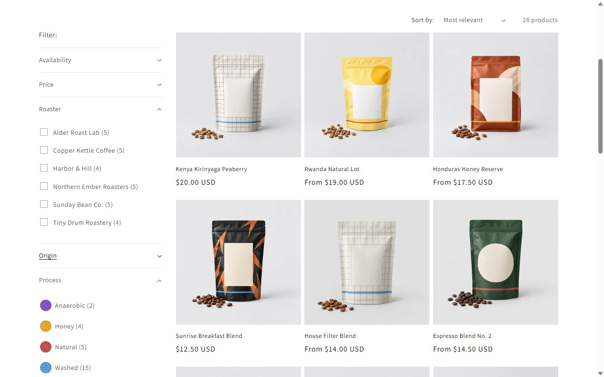
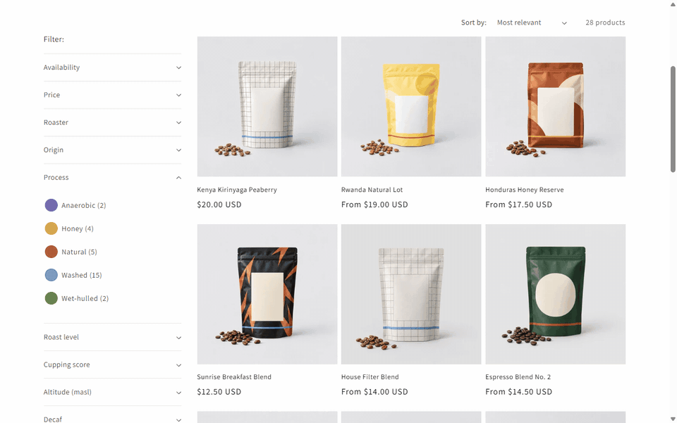
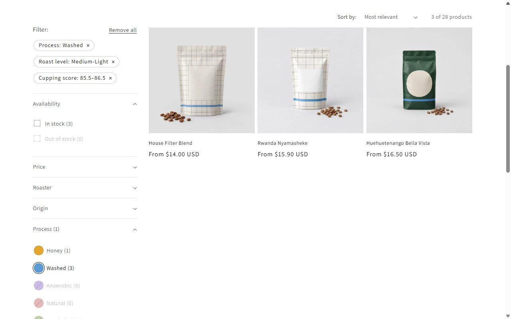
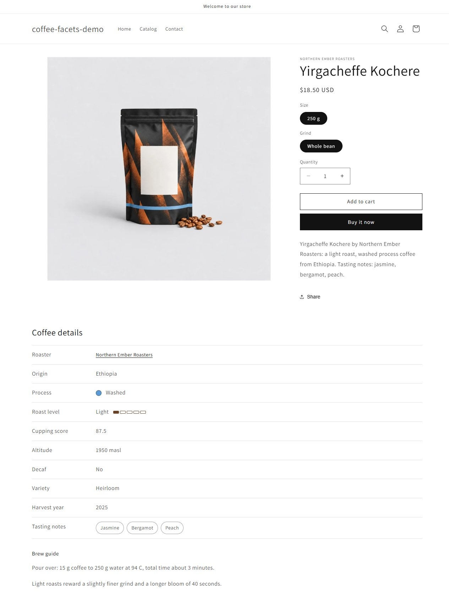
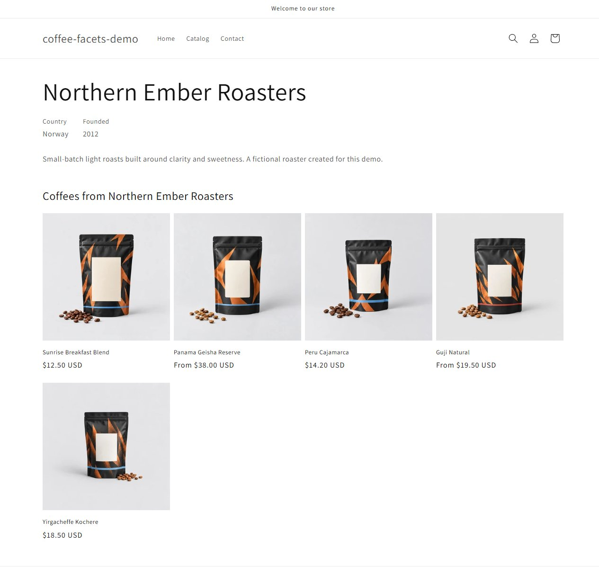
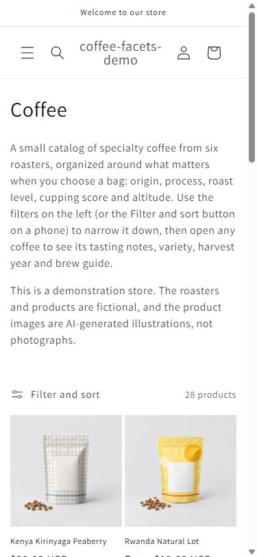
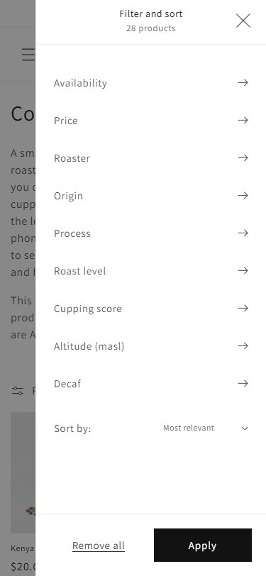

# Shopify metafields and facets: a coffee catalog without a filter app

A Dawn-based theme and a set of idempotent Admin API scripts that model a coffee catalog with **native metafields and metaobjects** and filter it with **Search & Discovery facets**: no third-party filter app.

## Live demo

**Storefront: <https://coffee-facets-demo.myshopify.com/collections/coffee>**
**Storefront password: `gawhiz`**

This is a Shopify development store, and development stores are always password protected. The password is shown here because it is not a secret: it only keeps the demo out of search engines.

**Portfolio demo.** The roasters and products are fictional and the product images are AI-generated illustrations, not photographs ([details](#ai-generated-media)). No client code, names, schemas or data are used in this repository.



Filtering in action: swatch filter, two list filters and a grouped numeric filter combine, chips show the state, and "Remove all" resets it.



| Filtered collection                                                | Product page                                          |
| ------------------------------------------------------------------ | ----------------------------------------------------- |
|  |  |

| Roaster page                                          | Phone                                                       | Phone filter drawer                                               |
| ----------------------------------------------------- | ----------------------------------------------------------- | ----------------------------------------------------------------- |
|  |  |  |

## What it shows

- A **data model** built from two metaobject definitions and eleven product metafields, with the validations and storefront access that Search & Discovery needs.
- A **migration workflow** on a deliberately dirty export: normalization with a dictionary, unknown values that stop the run, an idempotent seed, a pilot batch, then the full catalog, and a verification script.
- **Faceted filtering** with seven filters: single and list text, two numeric filters merged into labelled groups, a boolean and two metaobject references (one of them a visual color swatch).
- A **theme layer** in Liquid: a spec list on the product page and a page per roaster, both rendered from the metafields, plus filters that also work without JavaScript.
- A **batch media job**: AI-generated product images uploaded and attached through the Admin API, idempotent and validated before anything is sent.

Scope: 28 generated products, 6 roasters, 5 processing methods, 11 origins, 3 sizes by 4 grinds as variants. The size is deliberate: enough to exercise every facet and the whole workflow without pretending to be a production-scale catalog.

## Data model

Product metafields live in the `coffee` namespace; two metaobject definitions, `roaster` and `process_method`, back the references. Every definition has Storefront API access.

| Metafield       | Type                          | Facet | Notes                                                   |
| --------------- | ----------------------------- | ----- | ------------------------------------------------------- |
| `roaster`       | `metaobject_reference`        | yes   | links to the roaster page                               |
| `origin`        | `list.single_line_text_field` | yes   | blends list several countries                           |
| `process`       | `metaobject_reference`        | yes   | the `color` field of `process_method` drives the swatch |
| `roast_level`   | `single_line_text_field`      | yes   | five allowed values                                     |
| `cupping_score` | `number_decimal`              | yes   | 0 to 100, grouped into ranges                           |
| `altitude_masl` | `number_integer`              | yes   | 0 to 3000, grouped into ranges                          |
| `decaf`         | `boolean`                     | yes   |                                                         |
| `tasting_notes` | `list.single_line_text_field` | no    | high cardinality, shown as chips                        |
| `variety`       | `list.single_line_text_field` | no    | high-cardinality vocabulary                             |
| `harvest_year`  | `number_integer`              | no    | product page only                                       |
| `brew_guide`    | `rich_text_field`             | no    | product page only                                       |

Exactly seven are filterable, and the other four are deliberately not: a filter group is capped at 200 unique values and rich text cannot be filtered. Size and grind are product options, not metafields. Details, validations and the facet eligibility rules are in [docs/data-model.md](docs/data-model.md).

## Normalization and verification

The source is a generated export in `data/source/products.raw.json` with synonyms, mixed case, stray whitespace, decimal commas, feet and ounces, and HTML in text fields. `scripts/src/normalize.js` is a pure function with a dictionary; **a value it does not know is never skipped or guessed, it stops the pipeline.**

| Measure                                             | Result           |
| --------------------------------------------------- | ---------------- |
| Distinct raw values across the 13 normalized fields | 341              |
| Canonical values after normalization                | 162 (179 merged) |
| Values rejected as unknown                          | 0                |

`npm run normalize` writes the before/after report. Rules, formats and dictionaries are in [docs/normalization.md](docs/normalization.md).

`npm run verify` then checks the store against the same source of truth: missing products or metafields, values outside a dictionary, unexpected products (a handle with a numeric suffix means a duplicate), incomplete `Size x Grind` variants and prices, missing images and facet groups over 200 values. It also runs Admin API product searches on the seven metafields that have `adminFilterable` enabled and compares the counts with the source data, and confirms that a search on the four others is rejected, as it is on API version `2026-10`. That checks the data behind the facets; it does not test Search & Discovery itself, whose storefront facets were checked in the browser ([docs/facets.md](docs/facets.md), [docs/quality.md](docs/quality.md)). See [docs/seed-and-verify.md](docs/seed-and-verify.md).

The scripts that write to the store (`definitions`, `seed:metaobjects`, `seed:catalog`, `upload-images`) are safe to repeat: the second run reports `EXISTS`, `UNCHANGED` or `SYNCED` and creates nothing. Each of them has a `--dry-run` that only reads.

## Search & Discovery filters

The seven filters are enabled by hand in the Search & Discovery app; this repository does not script that step. The theme renders what the app returns with Dawn's vertical layout: a sidebar on desktop and a drawer on phones, active filter chips, "Remove all", sorting and a live result count. Process is displayed as colored swatches, taken from the metaobject's color field.

- The URL is the state: `?filter.p.m.coffee.roast_level=Medium-Light&filter.p.m.coffee.decaf=1`. A shared link reproduces it and the Back button restores it.
- The two numeric metafields are listed value by value unless merged; they are merged into labelled groups (`84–85`, `1,600–1,750 m`). A grouped value travels in the URL as the id of the group, which belongs to this store.
- Without JavaScript the panel is a plain GET form with an Apply button; with JavaScript the Section Rendering API updates the grid in place.

Setup steps, the URL formats seen on the live theme and the fixes made to Dawn's `facets.js` (lost second tick, focus handling) are in [docs/facets.md](docs/facets.md).

## Architecture and local setup

```
assets/ config/ layout/ locales/ sections/ snippets/ templates/   the theme (repository root, as the GitHub integration requires)
scripts/   Admin API client, definitions, normalization, seeds, verify, images
data/      generated source data, image prompts and the AI-generated images
docs/      data model, normalization, facets, theme, quality, asset records
tests/     130 unit tests, no network
```

Requirements: Node 22 or newer, and the [Shopify CLI](https://shopify.dev/docs/api/shopify-cli) for `theme dev` and Theme Check.

**Credentials.** Create the dev store in the Dev Dashboard and an app in the **same organization** (otherwise the client credentials grant fails with `Client credentials cannot be performed on this shop`). Give it the scopes `read_products`, `write_products`, `read_metaobjects`, `write_metaobjects`, `read_metaobject_definitions`, `write_metaobject_definitions`, `read_files`, `write_files`, `read_publications` and `write_publications`, install it on the store and copy `.env.example` to `.env`:

```
SHOPIFY_CLIENT_ID=
SHOPIFY_CLIENT_SECRET=
SHOPIFY_SHOP=your-store.myshopify.com
```

There is no static access token. `scripts/src/client.js` requests a token with the client credentials grant, keeps it **in memory only** until shortly before the server's `expires_in`, retries a request **once** after a `401` with a fresh token (a second `401` is a diagnostic error), and waits and retries when the API throttles. The API version is one constant, `2026-10`.

**Run order.**

```sh
npm ci
npm run smoke                       # token + shop { name }
npm run definitions                 # metaobject and metafield definitions (add :dry-run to preview)
npm run seed:metaobjects            # roasters and process methods
npm run seed:catalog:pilot          # 5 products, check the storefront
npm run verify:pilot
npm run seed:catalog                # all products
npm run images:check && npm run upload-images
npm run verify
```

Then connect the repository to the store's themes (Online Store, Themes, Add theme, Connect from GitHub), enable the seven filters in Search & Discovery, and merge groups for the two numeric filters if you want ranges. `npm run theme-check`, `npm run lint`, `npm run format:check` and `npm test` are the local checks, and CI runs them on every pull request.

**Branches.** `dev` is the integration branch and is connected to the development theme; `main` is the release branch and is connected to the published theme. Work happens in short-lived `feat/*` and `fix/*` branches merged into `dev`, and `dev` is merged into `main` as a release. Neither branch is protected, because the Theme Editor commits directly to the branch a theme is connected to.

## Quality

[docs/quality.md](docs/quality.md) has the full results. In short, the browser checks ran on the local development server and Lighthouse on the published store:

- `axe-core`: 0 violations on the collection, product and roaster pages at 1280 and 375 px.
- Keyboard, no-JavaScript, reduced-motion and 200% text reviewed; a filter ticked with the keyboard keeps focus, and the filters work without JavaScript.
- Lighthouse on the published store, mobile, median of three runs (Performance / Accessibility / Best Practices / SEO): collection 97 / 97 / 100 / 100, product page 93 / 97 / 100 / 100, roaster page 89 / 97 / 100 / 100. CLS is 0 everywhere and LCP is 2.1 to 3.5 s. The Accessibility 97 is a contrast report on elements that Dawn's reveal-on-scroll animation has not shown yet, and the roaster page LCP is slowed by a lazy-loaded card image; both are explained in the quality notes.
- Theme Check: 0 errors; the 9 warnings come from files inherited from Dawn.

## Limits of the approach

- Search & Discovery allows 25 filters per store, 200 unique values per filter group, 1,000 groups, and shows no filters on collections of more than 5,000 products ([help center](https://help.shopify.com/en/manual/online-store/storefront-search/search-and-discovery-filters)). This catalog never comes close, so the project does not demonstrate behavior at those limits.
- The filters were configured in the app's interface and are not created by the scripts, so a fresh store needs that manual step. Group ids in the URL belong to the store: recreate a group and old links stop working.
- Numeric metafields are filtered as discrete values or as merged groups, not with a price-style range slider.
- A metafield definition's type cannot be changed in place: it has to be recreated and the data seeded again. That is why the schema is reviewed before any data is written.
- The development store keeps its storefront password; a public showcase without one would need a paid plan.
- Nothing here measures or proves figures from any client migration. This is a synthetic demonstration, and the cost comparison with a paid filter app depends on the vendor's current pricing, which this repository does not state or compare. Where an app is still justified is a separate question: merchandising rules, scale beyond the limits above, or UI the theme cannot provide.

## License

- **Own files:** the code, documentation, tests, generated data and theme files created for this project are MIT, see [LICENSE](LICENSE).
- **Dawn:** the theme base is [Dawn](https://github.com/Shopify/dawn) `v16.0.0`, Copyright Shopify Inc. Every file that originates from Dawn, including the ones modified here (listed in [docs/third-party-assets.md](docs/third-party-assets.md)), stays under Dawn's [LICENSE.md](LICENSE.md), which only permits use for themes that integrate or interoperate with Shopify.

## AI-generated media

The 28 product images in `data/images/` were generated with Codex (OpenAI), from the prompts in `data/images/prompts.json` (derived from the catalog data). They are illustrations of fictional coffee bags, not photographs, and every image is uploaded with alt text beginning "AI-generated image of". Tool, purpose and date are recorded in [docs/ai-assets.md](docs/ai-assets.md), together with the status of the images under the repository license. The roaster names and the catalog data are invented.
